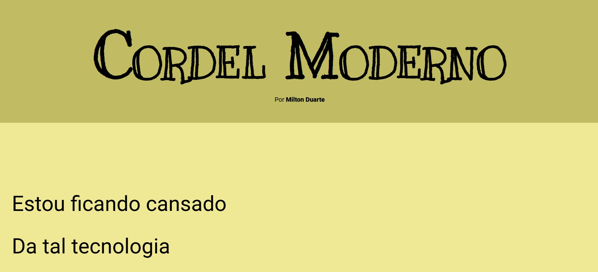

# Cordel Responsivo

Este repositório contém o projeto de um site **Cordel Responsivo**, desenvolvido como parte dos estudos das aulas do [Curso em Vídeo](https://www.cursoemvideo.com/) ministradas pelo professor **Gustavo Guanabara**.

O objetivo do projeto é praticar os conceitos de **HTML5** e **CSS3**, com foco em **responsividade** para diferentes dispositivos, seguindo as boas práticas ensinadas durante as aulas.

## Sobre o Projeto

O site apresenta um layout inspirado na literatura de cordel, utilizando imagens, efeitos de parallax e tipografia característica. O conteúdo, o design e a responsividade foram desenvolvidos de acordo com os ensinamentos do curso, proporcionando uma ótima experiência tanto em computadores quanto em celulares.

---

## 🖼️ Demonstração

👉 [Acesse o projeto online](https://brrn91.github.io/site-cordel/)

---

## 🛠️ Tecnologias Utilizadas

- **HTML5**
- **CSS3**
- Estruturação semântica e boas práticas de organização

---

## ⚙️ Funcionalidades

- ✅ Estrutura de página institucional
- ✅ Elementos estilizados com CSS
- ✅ Layout simples e responsivo
- 🚀 Hospedado facilmente no GitHub Pages

---

💡 **Nota:** Este projeto faz parte do meu aprendizado e portfólio. Feedbacks são sempre bem-vindos! 😊
